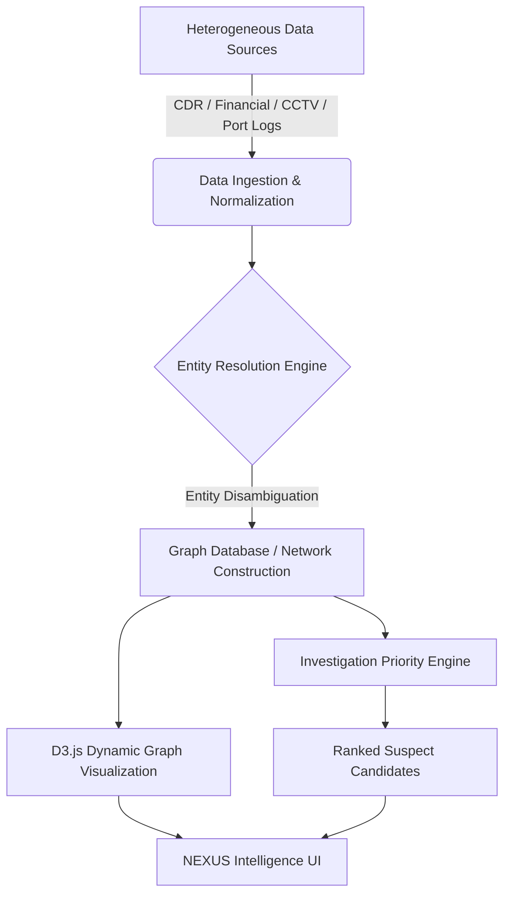

# 🕸️ NEXUS — AI-Powered Criminal Network Analysis Platform

> **Smart India Hackathon (SIH 2026)** | **Problem Statement ID: SIH26189**  
> *An advanced intelligence platform for law enforcement & security agencies to analyze criminal networks, perform entity resolution, rank suspect priorities, and track multi-source evidence.*

---

## 📌 Executive Summary

**NEXUS** is a state-of-the-art criminal network analysis & intelligence synthesis application designed to process, map, and visualize complex criminal syndicates. By ingesting heterogeneous, multi-source intelligence—including Call Detail Records (CDR), financial transaction logs, CCTV/co-location data, port/logistics records, and OSINT—NEXUS enables investigative agencies to:

1. **Uncover Hidden Criminal Syndicates**: Automatically construct multi-hop graph networks and detect concealed relationships between suspects, front companies, and logistics hubs.
2. **Automate Suspect Priority Ranking**: Employ multi-dimensional scoring (network centrality, cross-source evidence density, financial anomaly, co-location frequency) to present ranked investigation candidates.
3. **Execute Dual Investigation Modes**:
   - **Known Suspect Analysis**: Target ego-network exploration centered around a high-value suspect.
   - **Unknown Case Analysis**: Pattern mining, anomaly detection, and community discovery across unassigned evidence.
4. **Interactive Timeline & Evidence Ingestion**: Track chronological events, co-locations, call frequency spikes, and provenance of evidence items.

---

## ✨ Key Features & Modules

### 🔍 1. Interactive 2D Network Graph Engine
- **Force-Directed Visualization**: Built using **D3.js**, supporting drag-and-drop node physics, dynamic zooming, pan controls, and node selection.
- **Dynamic Hop Expansion**: Expand networks seamlessly from 1-hop direct connections to 2-hop or 3-hop deeper syndicate structures.
- **Node Classification**: Visual distinction between *Persons*, *Organizations*, *Vehicles*, *Locations*, *Financial Accounts*, and *Communication Nodes*.
- **Relationship Links**: Color-coded, weighted edges denoting relationship strength, interaction frequency, financial transfer amounts, or co-occurrence.

### 🎯 2. Dual Investigation Workflows
- **Known Suspect Investigation**:
  - Focuses on a selected target (e.g., *Devendra "Kingpin" Sharma*).
  - Displays ego-centric network graphs, direct accomplices, financial channels, and communication intensity.
- **Unknown Suspect / Case Investigation**:
  - Processes unassigned case evidence (e.g., *CASE-2026-014: Organized Financial Network*).
  - Runs automated analysis passes (parsing intelligence, entity extraction, entity resolution, graph construction, community detection, anomaly detection, and candidate ranking).
  - Outputs a prioritized shortlist of top investigation candidates with multi-factor risk scores and justification rationales.

### 👤 3. Comprehensive Person Profiling
- Detailed suspect profile cards including alias, risk rating (High/Medium/Low), role within syndicate, primary location, active cases, and key associates.
- Cross-source evidence provenance breakdown.
- Financial anomaly flags and communication spike indicators.

### 📁 4. Case Management Workspace
- Manage active, under review, closed, and archived investigative cases (e.g., *Operation Dark Stream*, *Port Smuggling Network*, *Money Laundering — Real Estate*).
- Case metadata: Investigating officer, entity counts, relationship density, network size, evidence count, and tags.

### 📜 5. Cross-Source Evidence Explorer
- Centralized evidence database covering CDRs, bank transfers, port entry logs, surveillance snapshots, and vehicle tracking.
- Filtering by source type, reliability confidence score, case association, and date range.

### ⏳ 6. Interactive Chronological Timeline
- Event progression plotting co-locations, wire transfers, phone calls, and suspicious activity over time.
- Time-slider filtering to observe how networks evolved during critical time windows.

### 🚨 7. Real-Time Threat & Anomaly Alerts
- Live alert feed flagging high-priority events:
  - *Unusual call frequency spikes between non-connected nodes*
  - *Structured financial transfers just below reporting thresholds*
  - *Repeated co-location of suspects at restricted logistics/port hubs*

### 📊 8. Analytics & Network Metrics Dashboard
- High-level intelligence metrics: Centrality distributions, degree metrics, crime type breakdowns, and syndicate density graphs.

---

## 🛠️ Technology Stack

| Layer | Technology | Description |
| :--- | :--- | :--- |
| **Frontend Framework** | **React 19** | Modern component-driven UI library |
| **Language** | **TypeScript 6** | Strict type safety and clear domain model interfaces |
| **Build Tool & Bundler** | **Vite 8** | High-performance Next-Gen frontend tooling |
| **Graph Visualization** | **D3.js (v7)** | Force simulation, custom canvas/SVG graph rendering |
| **Styling & Theme** | **TailwindCSS 4** | Glassmorphism cyberpunk dark theme UI design system |
| **Iconography** | **Lucide React** | Clean, modern vector icons |
| **Routing** | **React Router 7** | Client-side routing & nested layout routes |
| **Linter** | **Oxlint** | High-speed JavaScript/TypeScript linter |

---

## 📁 Project Directory Structure

```
criminal_network_analysis/
├── public/                     # Static assets and icons
├── src/
│   ├── assets/                 # App assets & styles
│   ├── components/             # Reusable UI Components
│   │   ├── graph/              # D3 NetworkGraph component & graph controls
│   │   ├── home/               # Dashboard widgets, CasesCircle, FloatingModules
│   │   ├── investigation/      # AnalysisAnimation & execution step simulators
│   │   └── layout/             # AppLayout, Sidebar, TopNav navigation
│   ├── data/                   # Synthetic SIH Demonstration Datasets
│   │   ├── alerts.ts           # Threat alert feeds
│   │   ├── cases.ts            # Active & archived criminal cases
│   │   ├── entities.ts         # Extracted entities (Accounts, Vehicles, Companies)
│   │   ├── evidence.ts         # Cross-source evidence records (CDR, Bank, CCTV)
│   │   ├── graphNodes.ts       # Network graph nodes & coordinates
│   │   ├── graphRelationships.ts # Graph edge connections & weights
│   │   └── persons.ts          # Suspect profiles & threat metrics
│   ├── pages/                  # Main Page Views
│   │   ├── HomePage.tsx        # Overview dashboard & Quick Launch
│   │   ├── NetworkAnalysisPage.tsx # Full-screen interactive graph studio
│   │   ├── KnownSuspectPage.tsx # Targeted suspect investigation
│   │   ├── UnknownSuspectPage.tsx # Case candidate ranking & analysis
│   │   ├── CasesPage.tsx       # Case management directory
│   │   ├── PersonsPage.tsx     # Persons of interest catalog
│   │   ├── PersonProfilePage.tsx # Individual suspect deep-dive
│   │   ├── EvidencePage.tsx    # Evidence repository
│   │   ├── TimelinePage.tsx    # Chronological timeline view
│   │   ├── AlertsPage.tsx      # Real-time threat feed
│   │   ├── DataSourcesPage.tsx # Ingested intelligence data sources
│   │   └── AnalyticsPage.tsx   # System metrics & network intelligence charts
│   ├── services/
│   │   └── investigationEngine.ts # Deterministic graph analysis & candidate ranking engine
│   ├── types/                  # TypeScript interfaces & types
│   │   ├── graph.ts            # D3 node, link, and layout definitions
│   │   └── index.ts            # Case, Person, Evidence, Alert, and Candidate models
│   ├── App.tsx                 # Main Application router & routes
│   ├── main.tsx                # Application entrypoint
│   └── index.css               # Design system & CSS custom variables
├── package.json                # Project dependencies & scripts
├── tsconfig.json               # TypeScript compiler config
└── vite.config.ts              # Vite configuration
```

---

## 🚀 Quick Start Guide

### Prerequisites
Ensure you have the following installed on your machine:
- **Node.js**: `v18.0.0` or higher
- **npm**: `v9.0.0` or higher

### 1. Installation
Clone the repository and navigate into the project folder:
```bash
cd criminal_network_analysis
npm install
```

### 2. Run Development Server
Start the local development server with Hot Module Replacement (HMR):
```bash
npm run dev
```
Open your browser and navigate to `http://localhost:5173`.

### 3. Build for Production
To compile and bundle the application for production:
```bash
npm run build
```

### 4. Preview Production Build
To preview the build locally:
```bash
npm run preview
```

### 5. Linting
Run Oxlint to check code quality and rules:
```bash
npm run lint
```

---

## 🧠 Intelligence Engine Algorithms

### Candidate Ranking Formula
NEXUS calculates a composite **Investigation Priority Score** ($S_p \in [0, 100]$) for each candidate using multi-factor weightings:

$$S_p = w_1 \cdot C_{net} + w_2 \cdot E_{cross} + w_3 \cdot F_{anom} + w_4 \cdot P_{comm} + w_5 \cdot L_{loc} + w_6 \cdot A_{beh}$$

Where:
- **$C_{net}$**: Network Centrality Score (Degree, Betweenness & Eigenvector Centrality)
- **$E_{cross}$**: Cross-Source Evidence Density (Diversity of CDR, Bank, CCTV sources)
- **$F_{anom}$**: Financial Anomaly Indicator (Structured payments, shell company routing)
- **$P_{comm}$**: Communication Pattern Intensity (Burst calls, off-hour contacts)
- **$L_{loc}$**: Location Correlation Frequency (Co-presence at critical sites)
- **$A_{beh}$**: Behavioral Anomaly Score (Burner phone switches, alias usage)

---

## 🗺️ System Architecture & Roadmap



### Phase 12 Roadmap Features
- **Graph Database Integration**: Native Neo4j / Memgraph connection via Cypher query builder.
- **Real-Time Streaming**: WebSocket integration for live CDR wiretaps and automated geofence triggers.
- **AI / LLM Intelligence Summarizer**: Automatic case report generation powered by Gemini / LLM models.
- **GIS Map Overlay**: Geospatial visualization of suspect co-location events on interactive GIS maps.

---

## 📄 License & Attribution

This project is developed for **Smart India Hackathon (SIH 2026)** under Problem Statement **SIH26189**.  
Designed for law enforcement intelligence demonstration purposes.
